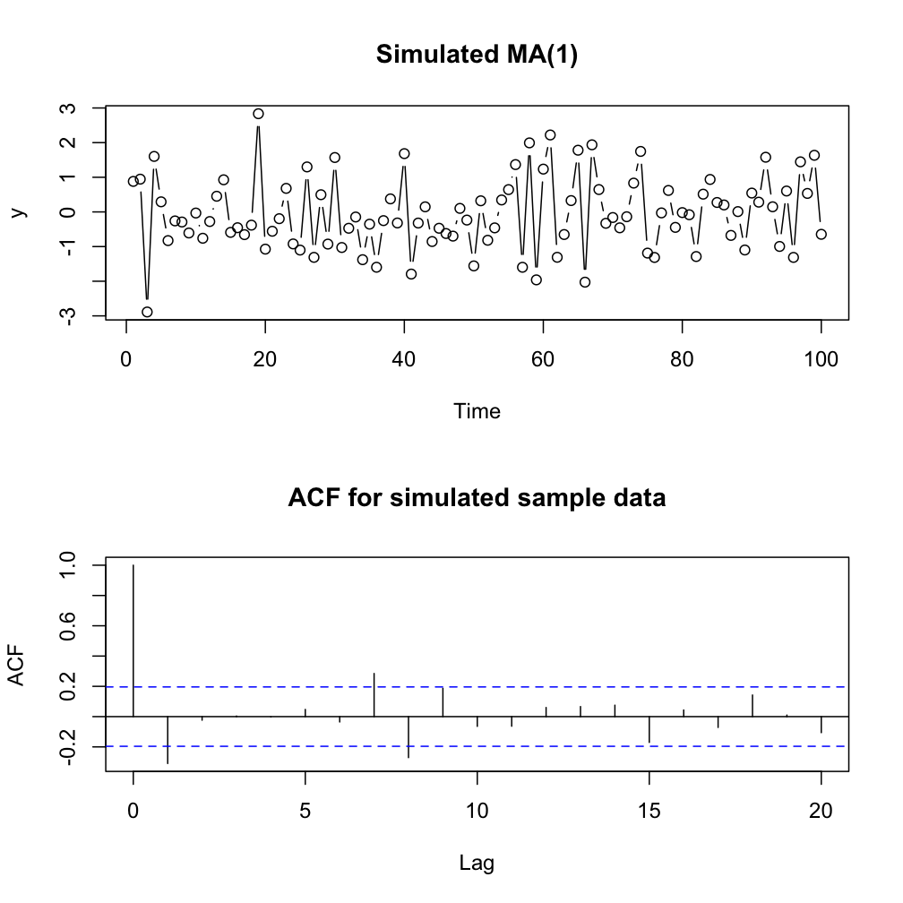

Time Series Analysis 1
========================================================
[Visit my website](http://rmdk.ca/projects/) for more like this! I would love to hear your feedback (seriously).

```r
require(astsa, quietly=TRUE, warn.conflicts=FALSE)
require(knitr)
library(ggplot2)
```
#### Data Sources:
Heavily borrowed from:

* Textbook: [Time Series Analysis and It's Application](http://www.stat.pitt.edu/stoffer/tsa3/)

* [Wikipedia](http://en.wikipedia.org/wiki/Stationary_process)

* [Online course](https://onlinecourses.science.psu.edu/stat510/?q=node/47) at Penn State

## Overview of Time Series

This lesson will describe some of the important features that need to be considered when dealing with time series analysis. Here we focus on a single time series, future lessons will incorporate more series.

* A __univariate__ time series is a sequence of measurements of the same variable collected over time. Most often, they occur at regular time intervals.

However, the major different from standard linear models is that the date/time data are not necessarily identically distributed, that is to say, the ordering matters, thus there is often dependency in the data.

#### Basic Analysis objectives:

The core objective of tsa is to generate a model that describes the true underlying trend of the time series.
With a properly specified mode we can:

1. Describe important feature of the ts pattern.
2. Explain how the past affects the future.
3. Explain how two time series interact.
4. Forecast future values of the time series.
5. Other real-life applications like serving as a control standard for a variable that measures some manufacturing operation.

#### Types of models:

There are two basic types of "time domain" models:

1. __ARIMA models__ (Auto regressive Integrated Moving Average), these are models that relate the present value of a series to past values and past prediction errors.
2. __Ordinary regression models__ that use time series as `x` variables. Like in classical statistics, these are often helpful for a first look at the data, and serve as a starting point for some forecasting methods.

#### Important Considerations
When first looking at a time series it is important too...

* Is there an underlying __trend__?
* Is there __seasonality__, or a regular repeating pattern of highs and lows?
* Is there a __long-run cycle__ or period unrelated to the seasonality?
* Are their __outliers__
* Is there __constant variance__ over time, or is it non-constant?
* Are there any __abrupt changes__ to any aspects of the series?

Let's look at some examples:

### Ex 1.0 Global Temperature

Linear models are applied frequently in time series analysis, and general statistics. Time series can be described by simple linear models, or in more complex cases, local regression models, polynomial models, and splines.

Let's create a simple linear model for global temperature data. If you need a refresher on regression, I have compiled a modest tutorial in an [IPython notebook](http://nbviewer.ipython.org/gist/RMDK/38aea576c3eda34b03a1).

```r
summary(fit<- lm(gtemp~time(gtemp)))
```

```
## 
## Call:
## lm(formula = gtemp ~ time(gtemp))
## 
## Residuals:
##     Min      1Q  Median      3Q     Max 
## -0.3195 -0.0972  0.0008  0.0825  0.2938 
## 
## Coefficients:
##              Estimate Std. Error t value Pr(>|t|)    
## (Intercept) -1.12e+01   5.69e-01   -19.7   <2e-16 ***
## time(gtemp)  5.75e-03   2.92e-04    19.6   <2e-16 ***
## ---
## Signif. codes:  0 '***' 0.001 '**' 0.01 '*' 0.05 '.' 0.1 ' ' 1
## 
## Residual standard error: 0.125 on 128 degrees of freedom
## Multiple R-squared:  0.751,	Adjusted R-squared:  0.749 
## F-statistic:  386 on 1 and 128 DF,  p-value: <2e-16
```

```r
plot(gtemp, type='o', ylab='Global Temperature')
abline(fit) # Add regression line
```


* There is an apparent  __constant trend__ upwards, and the time series seems to slowly wander up and down along this upward mean. We can see that the series is fairly centered around a mean value (red line).
* There is no obvious __seasonality__.
* There are no potential __outliers__.
* Hard to visual judge if the variance remains constant, but it appears fairly regular.

Now consider a more complex multiple regression model that predicts cardiovascular death using temperature and particulate matter pollution.

```r
par(mfrow=c(3, 1))

plot(cmort, main='Cardiovascular Mortality')
plot(tempr, main='Temperature')
plot(part, main='Particulates')
```



```r
pairs(cbind(Mortality=cmort, Temperature=tempr, Particulates=part))
```


We can see from the scatter-plot that temperature has a non-linear effect on CV mortality, as both high and low temperatures have an increase rate. This "U" shape is a very classical indicator of a non-linear effect. To account for this, we include the square of temperature in the model as well.

```r
temp = tempr - mean(tempr)  # normalize temperature
temp2 = temp^2
trend = time(cmort)  # The temporal data
# Fit the model
fit = lm(cmort ~ trend + temp + temp2 + part, na.action = NULL)
summary(fit)
```

```
## 
## Call:
## lm(formula = cmort ~ trend + temp + temp2 + part, na.action = NULL)
## 
## Residuals:
##     Min      1Q  Median      3Q     Max 
## -19.076  -4.215  -0.488   3.744  29.245 
## 
## Coefficients:
##              Estimate Std. Error t value Pr(>|t|)    
## (Intercept)  2.83e+03   2.00e+02   14.19  < 2e-16 ***
## trend       -1.40e+00   1.01e-01  -13.82  < 2e-16 ***
## temp        -4.72e-01   3.16e-02  -14.94  < 2e-16 ***
## temp2        2.26e-02   2.83e-03    7.99  9.3e-15 ***
## part         2.55e-01   1.89e-02   13.54  < 2e-16 ***
## ---
## Signif. codes:  0 '***' 0.001 '**' 0.01 '*' 0.05 '.' 0.1 ' ' 1
## 
## Residual standard error: 6.39 on 503 degrees of freedom
## Multiple R-squared:  0.595,	Adjusted R-squared:  0.592 
## F-statistic:  185 on 4 and 503 DF,  p-value: <2e-16
```

```r
par(mfrow=c(2,2))
plot(fit)
```


We can see from the diagnostic plots that there is certainly some degree of auto correlation in the residuals, which will address how to deal with later.

## 1.2: Lagged Regression

One of the simplest models we can employ on this data is an __AR(1) model__ (auto regressive model of order 1), which is a linear ARIMA model that uses the values of `t - 1` to predict `t`. 

The first step towards generating this model is to simply plot the time series against the __lag 1 values__ of the same series. 


```r
lag.plot(gtemp, lags=1, do.lines=FALSE)
```


This is a strong relationship, and there is a consistent positive linear association for the lagged plot, thus and AR(1) model may be useful here. an AR(1) model takes the form:
$$xt=δ+ϕ1xt−1+wt$$

* Assumes that the errors are independently distributed with a normal distribution.
* Error terms are independent.

This is just like regular OLS regression, except that we cannot assume that the x-variable is not random. We ignore this now and proceed with regular OLS methods.

We must align the lagged series prior to running the regression, this is accomplished using `ts.intersect`.

```r
x<-lag(gtemp, 1)
data = ts.intersect(gtemp, x, dframe=TRUE)

summary(fit<- lm(data[,1] ~ data[,2]))
```

```
## 
## Call:
## lm(formula = data[, 1] ~ data[, 2])
## 
## Residuals:
##     Min      1Q  Median      3Q     Max 
## -0.2575 -0.0694 -0.0200  0.0628  0.2854 
## 
## Coefficients:
##             Estimate Std. Error t value Pr(>|t|)    
## (Intercept) -0.00883    0.00939   -0.94     0.35    
## data[, 2]    0.88569    0.03763   23.54   <2e-16 ***
## ---
## Signif. codes:  0 '***' 0.001 '**' 0.01 '*' 0.05 '.' 0.1 ' ' 1
## 
## Residual standard error: 0.106 on 127 degrees of freedom
## Multiple R-squared:  0.814,	Adjusted R-squared:  0.812 
## F-statistic:  554 on 1 and 127 DF,  p-value: <2e-16
```

In this particular case, a simple lagged regression model is highly effective for obvious reasons. We are able to explain about 81% of the variation in the data, which is about 8% more than regular linear OLS.

#### Residual Analysis

```r
par(mfrow=c(2, 2))
plot(fit)
```


In this case, there is a slight auto correlation problem in the residuals, which we will address later.


-----
### The Autocorrelation Function
Since correlation is such an essential component of time series analysis, the best descriptive statistics are expressed in terms of co-variance and correlation.

We have already explored some of the tools for identifying autocorrelation using (1) a simple time series plot, (2) a lagged scatter plot, and (3) the autocorrelation function - described below.

* __The Autocorrelation function__ (ACF) is defined as:
$$ρ(s,t) = 􏰿γ(s,s)γ(t,t)$$
This function measures the cross-correlation of a signal with itself. Simply, it is the similarity between observations as a function of the time lag between them. The ACF gives correlations between xt and `xt-1`, `xt` and `xt-2`, and so on.

The ACF can be used to identify some structure in the ts data, yet there is often no single clear-cut interpretation of the ACF results.
The ACF is also useful for verifying that the model residuals are not autocorrelated with time. Using the dotted lines, which indicate the bounds for statistical significance, we can see that there are in fact a few observations which are auto correlated, which is bad for regression residuals. This is because autocorrelated complicates statistical tests by redicing the number of truely independent observations, and reduce out ability to identify correlation between other predictor variables. 


```r
acf(fit$residuals)
```


* __Cross-correlation__ is a measure of similarity between _two_ time series as a function of a time lag applied to one of them.


#### Cross correlation interpretation example

Consider a time series of the __Southern Oscillation Index (SOI)__ and __new fish recruitment__. This SOI is an indicator of the intensity of the El Nino or La Nina events.

First let's investigate the temporal behavior of the two series by inspecting the ACF and CCF. The relationship between two time series in terms of CCF is helpful for identifying lags of `x` that might be good predictors of the `y`, which is what we are trying to accomplish in __lagged regression__. We can see that both series oscillate on a twelve month cycle (each `lag` is 1 year), whereby they experience 'highs' on a yearly basis, and 'troughs' every other 6 months. For the CCF, the presence of negative lags means that SOI _leads_ fish recruitment, which lends us the conclusion that the time series move in different directions. As SOI increases, fish recruitment decreases. Further, we see that the CCF peaks at h = -6 (each line is a month), showing that the SOI measured at t - 6 months is associated with the fish recruitment at time t


```r
par(mfrow=c(3,1))
acf(soi, 48, main='SOI')
acf(rec, 48, main='Fish Recruitment')
ccf(soi, rec, 48, main='SOI vs Fish', ylab='CCF')
```


```r
fish = ts.intersect(rec, soiL6=lag(soi,-6), dframe=TRUE)
summary(lm(rec~soiL6, data=fish, na.action=NULL))
```

```
## 
## Call:
## lm(formula = rec ~ soiL6, data = fish, na.action = NULL)
## 
## Residuals:
##    Min     1Q Median     3Q    Max 
## -65.19 -18.23   0.35  16.58  55.79 
## 
## Coefficients:
##             Estimate Std. Error t value Pr(>|t|)    
## (Intercept)    65.79       1.09    60.5   <2e-16 ***
## soiL6         -44.28       2.78   -15.9   <2e-16 ***
## ---
## Signif. codes:  0 '***' 0.001 '**' 0.01 '*' 0.05 '.' 0.1 ' ' 1
## 
## Residual standard error: 22.5 on 445 degrees of freedom
## Multiple R-squared:  0.363,	Adjusted R-squared:  0.362 
## F-statistic:  254 on 1 and 445 DF,  p-value: <2e-16
```

The next lesson will go into these subjects with more detail. Follow to the next lesson [here](http://rpubs.com/ryankelly/19055).

-----
#### Another Example: Beer Production in Australia

```r
beer = read.csv('http://homepage.stat.uiowa.edu/~kchan/TSA/Datasets/beersales.dat')
```


```r
plot.ts(beer, type='o')
```


* There is an upward trend, possibly a curved one.
* There is clear seasonality.
* There may be increasing variation across time.

While there are specific ARIMA models for dealing with series with trends and seasonality, we will use OLS regression again here just to get started.

Using regular OLS, we might try to model the pattern as a combination of overall trend or quadratic trend, and dummy variable for predicting the quarterly seasonal oscillations.


