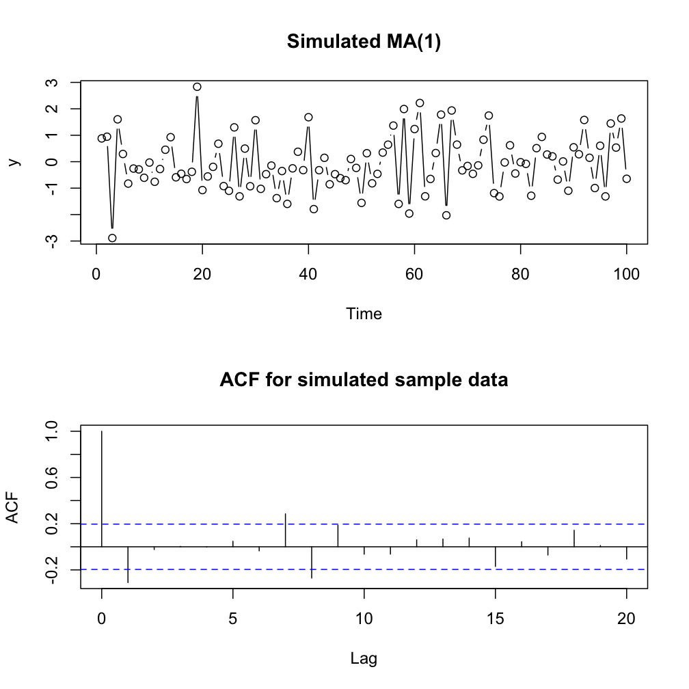
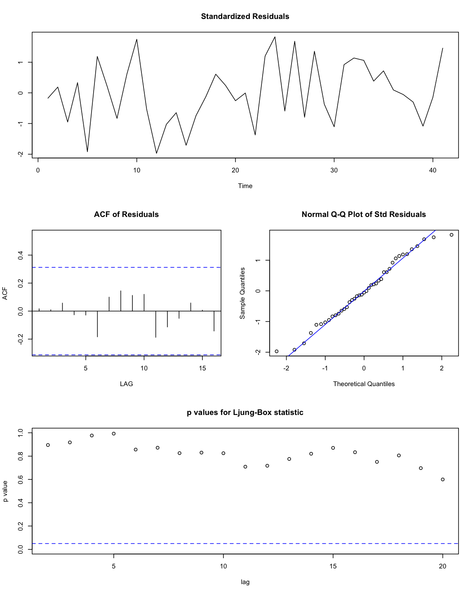
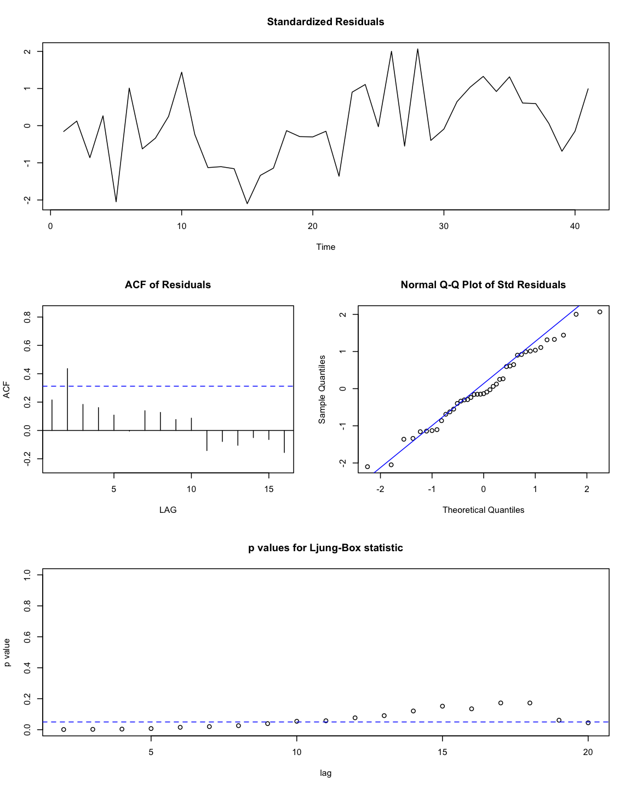
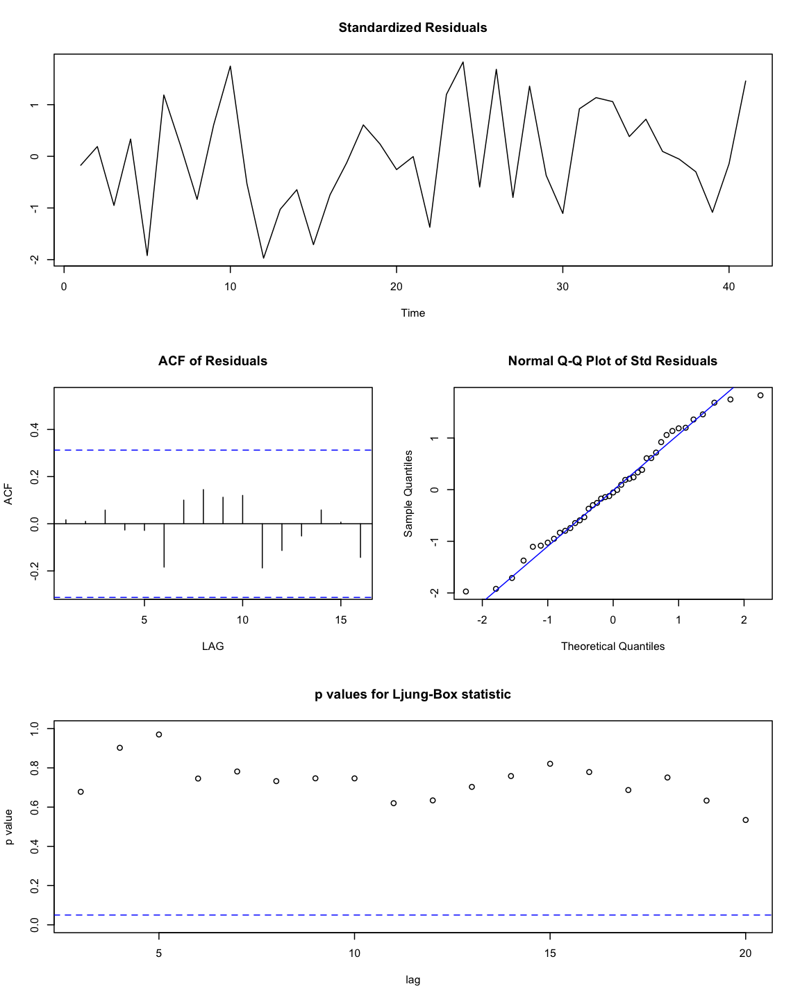

Time Series Analysis 2
========================================================
[Visit my website](http://rmdk.ca/projects/) for more like this! I would love to hear your feedback (seriously). 

```r
require(astsa, quietly=TRUE, warn.conflicts=FALSE)
require(knitr)
library(ggplot2)
```
#### Data Sources:
Heavily borrowed from:

* Textbook: [Time Series Analysis and It's Application](http://www.stat.pitt.edu/stoffer/tsa3/)

* [Wikipedia](http://en.wikipedia.org/wiki/Stationary_process)

* [Online course](https://onlinecourses.science.psu.edu/stat510/?q=node/47) at Penn State

## 1.0 Stationarity

In general, it is necessary for time series data to be stationary to satisfy the assumption of time series analysis models.

* __Stationarity__,  or a stationary process is a stochastic process whose joint probability distribution does not change when shifted in time. Consequently, the mean and variance, if present, do not change over time or follow any trends. In time series analysis, we often have to transform raw data to a stationary process to satisfy the assumptions of time series analysis models and functions. This definition of stationary is known as _strict stationarity_, and is generally too strong for most modeling applications. Thus most analysis utilize a milder version called _weak stationarity_.

* __Weak Stationarity__ only requires the `mean` and `covariance` to remain constant with respect to time. We will now reference weak stationary as simply, stationary.

Many stationary series have recognizable patterns for their ACF and PACF, which makes them excellent for identifying the type of ARIMA model to use. However, in raw form, most data are not stationary. A continuous downward trend, for example, violates the stationary since the mean is not constant with `t`. If the mean and variance are changing, it makes prediction very difficult! 

__If we remove the trend that causes these violations, we can start to understand the factors that are generating the other seasonal or periodic components.__

### 1.1 How to Transform Data to Stationary

To make data stationary, we must remove the trend, thus the most important step in this process is correctly identifying and modeling the trend within the time series. We do this through various curve fitting techniques, such as linear regression, polynomial regression, or more complex curve fitting techniques.

We can see that the Global temperature data from [TSA1](http://rpubs.com/ryankelly/tsa1) is not stationary, as there is a clear increasing trend over time. This is one of the easier non-stationary to work with, whereby the process has stationary behavior around the clear linear trend.
$$xt = μt + yt$$

where `xt` are the observations, `μt` is the trend, and `yt` is some random stationary process.

In this case, attaining stationarity can be achieved by generating a reasonable linear estimate of the trend component, and then simply subtract the trend and work just with the residuals (leftover error). However, in many cases, the trend is not linear and has to be fit with alternative methods.

An alternative to curve fitting approaches to remove the trend is __first differencing__. A non-stationary time series can be made stationary by taking the first (or higher order) differences. The first difference is the time series at time `t` minus the series at time `t - 1`. If for example the slope of the mean is also changing with time (quadratic), we can apply the second difference, or the first difference of the first difference.


```r
fit = lm(gtemp~time(gtemp), na.action=NULL) # generate linear model
```

```r
par(mfrow=c(2, 1))
plot(resid(fit), type='o', main="Detrended")
plot(diff(gtemp), type='o', main='First Difference')
```


To verify that our data has indeed become stationary, we can consult an ACF plot.


```r
par(mfrow=c(3, 1))
acf(gtemp, 48, main='gtemp')
acf(resid(fit), 48, main='detrended')
acf(diff(gtemp), 48, main='first differences')
```



An advantage of differencing over detrending is that no parameters are _estimated_ in the differences operation. However, this benefit is also a disadvantage if you want to utilize an estimate of the trend at some point anyways. However, if the goal is simply to coerce the data to stationarity, differencing may be more appropriate.

> Note: not explored here, yet there is also a technique called fractional differencing, whereby we can apply non-linear transformations to coerce the data to stationary. Ex. Log transformation. 

We will see that by understanding how to detrend a time series, we gain insight into how we will model it later. For example, we can see that we can eliminate almost all auto correlation in the global temperature data by applying first differences detrending. This may imply that this series is nearly a random walk with drift.

### 2.0 Smoothing techniques to discover trends

Here are some examples of smoothers that can be used to understand the underlying trends, and/or seasonality of a time series. If you need a refresher on curve fitting, see my modest [IPython notebooks](http://rmdk.ca/machine-learning-curve-fitting/).

#### 2.1 Moving Average Smoother

Consider the data for weekly cardiovascular mortality.

```r
plot(cmort, type='o')
```


To extract the monthly trend, we could apply a 5 point moving average on the data (5 weeks). To extract the general trend (the gentle negative slope) we could use a 53-point (1 year) moving average.


```r
ma5<- filter(cmort, rep(1,5)/5)
ma53<- filter(cmort, rep(1,53)/53)
```

```r
plot(cmort, type='p', ylab='mortality')
lines(ma5, lwd=2); lines(ma53, lwd=2)
```


#### 2.2 Polynomial and Periodic Regression Smoother

These modern regression techniques can be used to fit general smoothers. The problem with regression, compared to moving averages, is that it is a global metric that assumes the same function over a range of `t`, which may not be the case. Yet, regression methods are suitable for many locations.


```r
wk = time(cmort) - mean(time(cmort)) # Normalize data
#Specify polynomial functions
wk2 = wk^2; wk3 = wk^3
cs = cos(2*pi*wk); sn = sin(2*pi*wk) # estimate curves for monthly average

reg1 = lm(cmort ~ wk + wk2 + wk3, na.action=NULL)
reg2 = lm(cmort ~ wk + wk2 + wk3 + cs + sn, na.action=NULL)
```

```r
plot(cmort, type='p', ylab='mortality')
lines(fitted(reg1)); lines(fitted(reg2))
```



#### 2.3 Kernel Smoothing

Kernel smoothing is a type of moving average smoother that uses a weight function (or kernel), to average nearby observations. The wider the bandwidth, the smoother the results.

```r
plot(cmort, type='p', ylab='mortaility')
lines(ksmooth(time(cmort), cmort, 'normal', bandwidth=5/52))
lines(ksmooth(time(cmort), cmort, 'normal', bandwidth=2))
```



#### 2.4 Lowess and Nearest Neighbor Regression (NNR)

NNR is based on k-nearest neighbors linear regression that can be accessed in `R` using `supsmu`.

Lowess (`lowess` in `R`) is a complex smoother, also similar to KNN. First a certain proportion of nn to ``xt`` are included in a weighting scheme whereby closer values get more weight. Then a robust weighted regression is used to predict `xt` to generate the smoothed estimate. The more nn included, the smoother the estimate will be.


```r
par(mfrow=c(2,1))
plot(cmort, type='p', ylab='Mortality', main='nearest neighbor')
lines(supsmu(time(cmort), cmort, span=0.5)) # n/2 for trend component
lines(supsmu(time(cmort), cmort, span=0.01), col='blue')# n/100 for seasonal component

plot(cmort, type='p', ylab='Mortality', main='lowess')
lines(lowess(cmort, f=0.02), col='blue')# seasonal component (2% of data)
lines(lowess(cmort, f=2/3))# trend (2/3 of data)
```



#### 2.5 Splines

Splines are an extension of polynomial regression whereby we divide all times _t_ into _k_ intervals called _knots_. For each intervals, a regression is fit with typically three parameters (cubic spline). In `R` we can manipulate the expression of the smoothing split using the `spar` attribute. By default, the smoothing spline "optimally" assesses `spar` for the seasonal component. A trend can be fit with `spar = 1`.


```r
plot(cmort, type='p', ylab='Mortality')
lines(smooth.spline(time(cmort), cmort))
lines(smooth.spline(time(cmort), cmort, spar=1))
```


#### 2.6 Smoothing one Series as a Function of Another

In this example, we simply illustrate that we can apply smoothing techniques to scatter plots of two (or more) variables, such that we can understand the trend of the relationship between n>1 features.

Here we can start to identify trends such as, there are higher mortality rates at extreme temperatures (hot and cold), but mortality is higher at lower temperatures.


```r
par(mfrow=c(2, 1))

plot(tempr, cmort, main='lowess', xlab='Temperature', 
     ylab='Mortality')
lines(lowess(tempr, cmort))

plot(tempr,cmort, main='Smoothing Splines', xlab='Temperature', 
     ylab='Mortality')
lines(smooth.spline(tempr, cmort))
```


> Note: all these above methods assume the data are not serially correlated.

Next we move onto [ARIMA Models](http://rpubs.com/ryankelly/tsa3)
